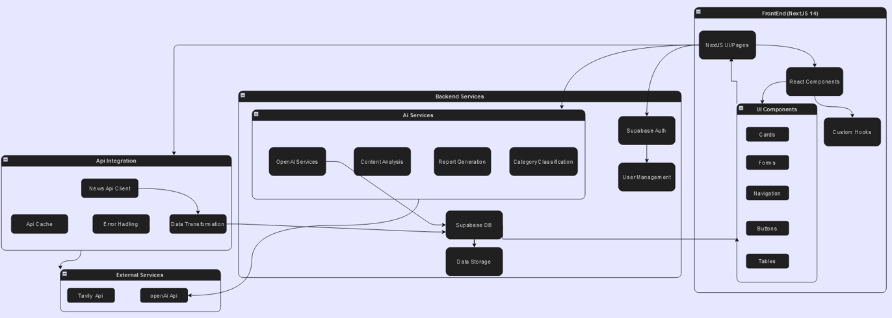
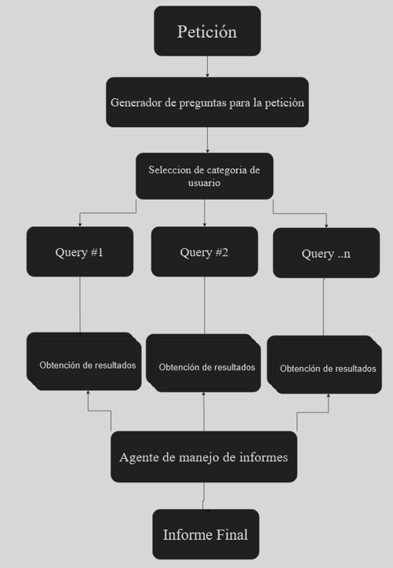

# 📰 NewsEye – AI-Powered Research & Reporting Tool  

  
  
  
  
  

---

## 📖 Descripción  

**NewsEye** es una herramienta web de investigación y generación de informes potenciada por **IA Generativa**.  
Su función principal es **automatizar la búsqueda de información en múltiples fuentes, analizarla y generar reportes adaptados al tipo de usuario** (intención, formato y tono).  

El sistema integra búsqueda avanzada, optimización de resultados y redacción en lenguaje natural, lo que permite:  

- Reducir tiempos de investigación.  
- Obtener resúmenes claros y estructurados.  
- Ajustar el estilo de los informes según las necesidades del usuario.  

---
## 🎥 Demo del Proyecto

---
## 🛠️ Tecnologías principales  

- **Frontend:** React  
- **Backend:** Next.js  
- **Base de Datos:** Supabase  
- **IA / LLM:** OpenAI  
- **Búsqueda optimizada:** Tavily  

---

## 📌 Características  

- 🔎 **Automatización de búsqueda:** conexión con Tavily y NewsAPI para recopilar información relevante.  
- 🤖 **Reportes dinámicos:** uso de LLMs para adaptar tono, formato e intención.  
- ⚙️ **Arquitectura modular:** fácil de escalar y mantener.  
- 📂 **Persistencia de datos:** usuarios e informes gestionados en Supabase.  
- 🎨 **UI moderna e interactiva:** construida con Radix UI, TailwindCSS y Framer Motion.  
- 📑 **Exportación de informes:** generación de reportes en PDF y visualización en la aplicación.  

---

## 🏗️ Arquitectura del sistema

Aquí se muestra la arquitectura de software del proyecto:

---

## 🔄 Flujo de trabajo IA

Descripción del flujo de trabajo con IA y automatización:

---

## 📂 Estructura del proyecto

AINewsResearcher/

│── app/                  # Código principal Next.js

│── components/           # Componentes de UI reutilizables

│── pages/                # Rutas y vistas

│── lib/                  # Funciones auxiliares

│── public/               # Recursos estáticos

│── styles/               # Configuración de TailwindCSS

│── package.json          # Dependencias y scripts

│── README.md             # Documentación

└── docs/                 # Diagramas (arquitectura, flujo, datos)

---

## ⚡ Requisitos

- Node.js 18+
- Next.js 15
- Cuenta y proyecto en Supabase
- API Key de OpenAI
- API Key de Tavily

---

## ▶️ Uso

1.Inicia sesión con tu cuenta (gestión de usuarios con Supabase).

2.Ingresa un tema de investigación o palabras clave.

3.El sistema recopilará información desde distintas fuentes.

4.Recibirás un informe generado por IA que podrás:

  - Visualizar en la aplicación.
  
  - Descargar en PDF.
  
  - Personalizar según intención y tono.
  
---

## 📄 Dependencias principales

Este proyecto utiliza librerías y frameworks modernos, entre ellas:

  - **UI & UX**: Radix UI, TailwindCSS, Framer Motion, Geist UI
  
  - **Gestión de formularios**: React Hook Form + Zod
  
  - **Autenticación y DB**: Supabase
  
  - **IA & APIs externas**: OpenAI, Tavily, NewsAPI
  
  - **Exportación de documentos**: jsPDF, html2canvas
  
(Ver todas en package.json)

---

🌟 Próximos pasos

- Ampliar integración con más fuentes de noticias.

- Mejoras en el pipeline de IA para análisis más profundo.

- Generación de dashboards interactivos con métricas de las búsquedas.

